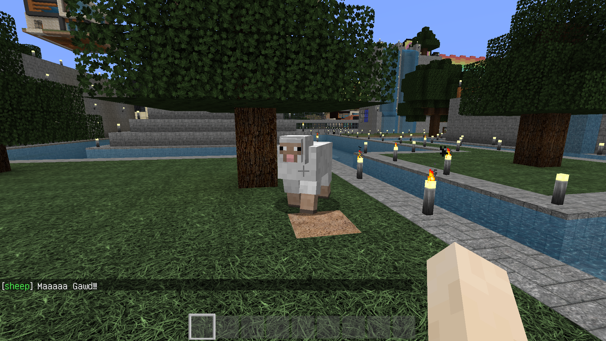

# TalkingMobs

A Minecraft Bukkit plugin which lets mobs talk to the player.

## Installation

You can get the latest release from [bukkit.org](https://dev.bukkit.org/projects/talkingmobs) or [GitLab](https://gitlab.com/Programie/TalkingMobs/-/jobs/artifacts/master/raw/target/TalkingMobs.jar?job=maven-deploy).

You may also check out the project from the repository and build it yourself (See Build section bellow).

## Permissions

TalkingMobs knows the following permissions:

* `talkingmobs` - Required to access the /talkingmobs command (Default: everyone)
* `talkingmobs.receive` - Allow to receive messages from mobs (Default: everyone)
* `talkingmobs.reload` - Allow to reload the configuration (Default: op)
* `talkingmobs.*` - Allow access to all features (Default: op)

## Commands

The `/talkingmobs` command is the one and only command provided by this plugin.

**Usage:** `/talkingmobs [subcommand] [arguments]`

The following sub commands are currently available:

* `help` - Show the help of the plugin
* `reload` - Reload the configuration
* `toggle` - Toggle messages sent by mobs
* `version` - Show the version of the plugin

## Event types

The following event types are currently available and can be used for the type in the `/talkingmobs toggle <type>` command and in the configuration files.

* `attacked` - Mob has been attacked by a player
* `idle` - Mob is idle, for example the mob is just standing/walking/running around (Currently unused)
* `interacted` - Player interacted with the mob (Right click on mob)
* `killed_player` - Mob has been killed by a player
* `killed_other` - Mob has been killed by something else (not a player)
* `looking` - Mob is looking at the player (and player is looking at the mob)
* `spawn` - Mob has been spawned (Mob spawner, egg or another plugin by default, but can be configured in config.yml)
* `tamed` - Mob has been tamed

Additional to those event types, the `killed` event type can be used in the messages configuration to define a message for both types (player and other).

## Configuration

The main configuration can be changed by editing the [config.yml](src/main/resources/config.yml) file.

All messages can be customized in the [messages.yml](src/main/resources/messages.yml) file.

## Build

You can build the project in the following 2 steps:

 * Check out the repository
 * Build the jar file using maven: *mvn clean package*

**Note:** JDK 1.7 and Maven is required to build the project!